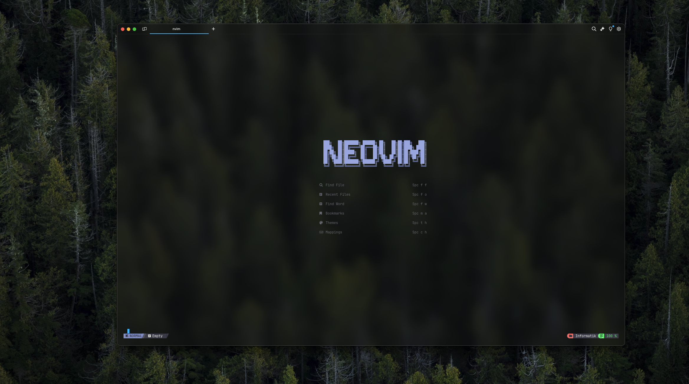

# My Personal Neovim Configuration for Rust
<div>
   
</div>

## Custom Commands
 - `<leader-cr>` - runs rust 
 - `<leader-sw>` - runs swift 
 - `g++` compiles & executes c++ file 
 - `gcc` compiles & executes swift file 


## Clone this Repository
 ```sh
    git clone https://github.com/LongdeLao/nvim ~/.config/nvim
 ```
